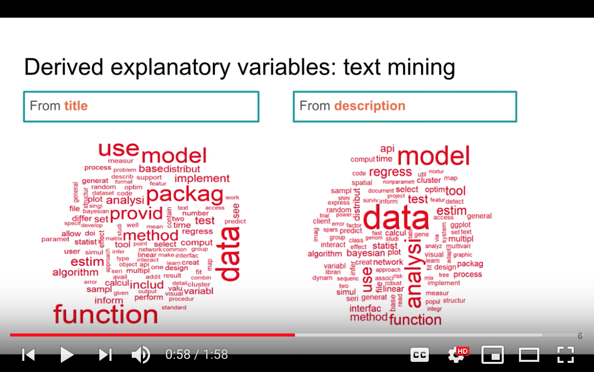
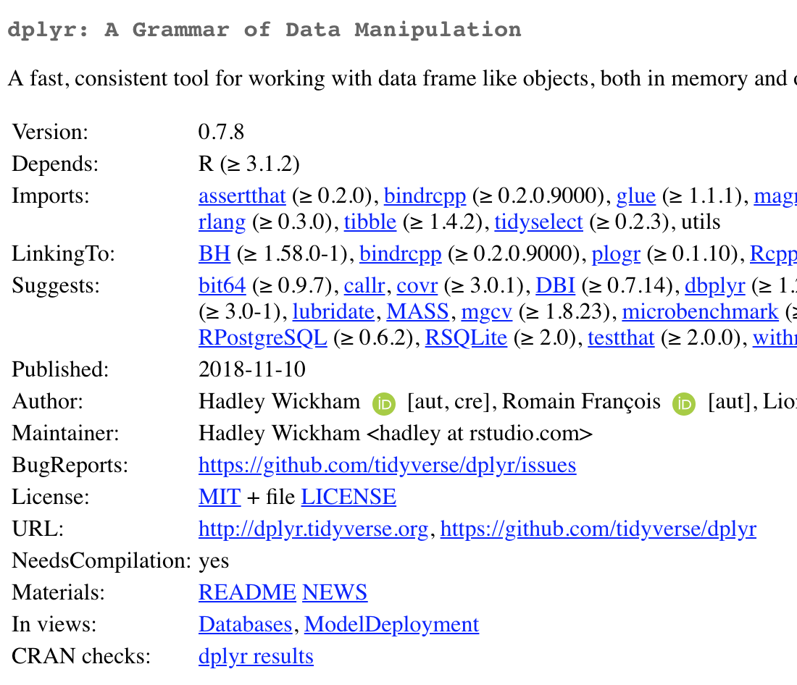
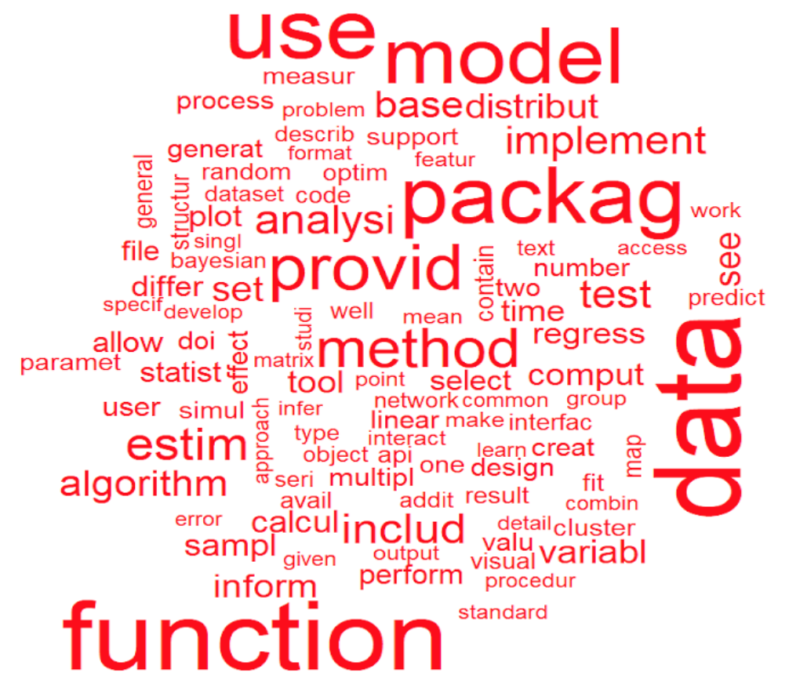
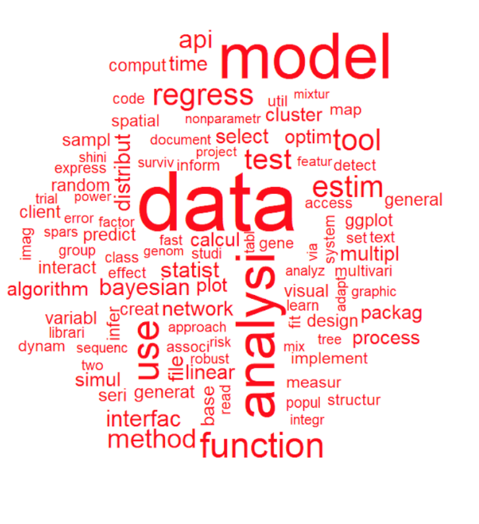
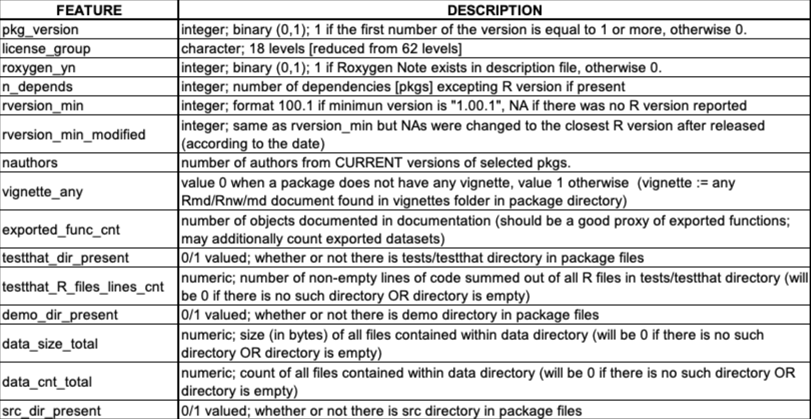
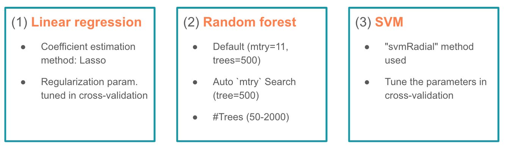
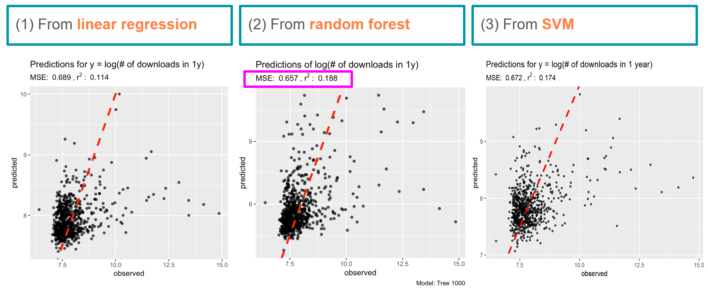
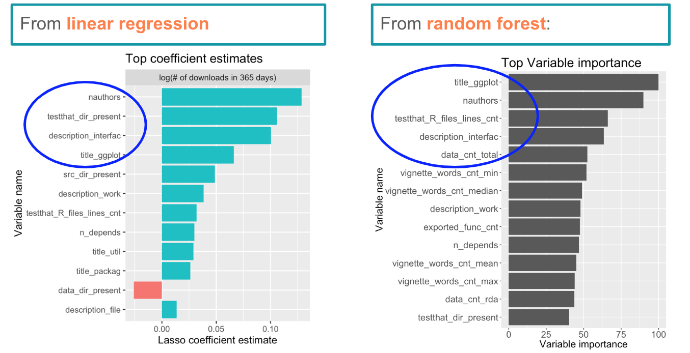

This is a website of the project "How successful your next R package will be? A prediction model using `R` packages features" by:

1.  Daniel Antiporta,
2.  Marta Karas,
3.  Perry Kuo.

The website is a part of the final assignment in 140.712.01 Advanced Data Science II class of 2018/19 at JHSPH.

Location of project's screencast
================================================================

Two minute screencast with narration showing a demo of the project can be accessed by clicking the image below (equivalently, click [here](https://youtu.be/eEBjMXPTmEw)).

Location of project's GitHub repository
=======================================================================

The project's GitHub repository can be found here: <https://martakarass.github.io/712_final_project>

In particular, the project's GitHub repository contains:

-   final RMarkdown file: [2018-12-09-project-summary.Rmd (link)](https://github.com/martakarass/712-final_project/blob/master/Rmd_files/2018-12-09-project-summary/2018-12-09-project-summary.Rmd)

-   corresponding compiled HTML file: [2018-12-09-project-summary.html (link)](https://github.com/martakarass/712-final_project/blob/master/Rmd_files/2018-12-09-project-summary/2018-12-09-project-summary.html)

Motivation and Overview
=======================

How many times you have found yourself spending long, long hours wrapping up an `R` package, polishing and pushing it to CRAN, and realize after that almost nobody downloads it and uses it?

Hence, you may keep asking yourself:

-   How successful my next R package will be?
-   What makes it successful?

Here we come, with the **How successful your next `R` package will be?** modeling tool that analyzes your package prototype based on its:

1.  title and description text,
2.  meta data,
3.  code files content,
4.  attached data content,
5.  vignettes content

and **predict a number of downloads it will generate** over the time!

Project objectives
==================

1.  Develop a predictive model that takes as an input package's features and predicts a number of downloads it will generate over (a) 3 months, (b) 1 year.

2.  Identify what features of an `R` package derived from package's features such as: title and description text, metadata, code files content, attached data content, vignettes content etc. are associated with a high number of downloads.

Data sources: examples
======================

Data sources we used include:

-   `R` packages’ description sites (from CRAN) information,
-   `R` packages’ archive’s files (from CRAN) to access information about the package from its 1st release version,
-   Utilizing already existing tools to get selected package's statistics (metadata, download numbers etc.)

Exemplary data source: R package CRAN site

Derived explanatory variables: text mining
==========================================

Examples of words (word's cores) in features generated from package's title (*LEFT HAND SIDE*) and package's description (*RIGHT HAND SIDE*):

Derived explanatory variables: examples
=======================================

Examples of words (word's cores) in features generated from package's meta data, code files, attached data content, vignettes:

Utilized modeling approaches
============================

We have trained and tuned three different types of predictive model:

Results: prediction MSE on test set
===================================

The prediction results of the outcome **logarithm of number of downloads over 1 year time** on the test set are shown below.

Results: explanatory variables
==============================

The top variables in terms of:

-   for linear regression: absolute value of coefficient estimate (note data frame of explanatory variables has been standardized to have mean 0 and variance 1),
-   for random forest: variable importance statistic

from modeling the outcome **logarithm of number of downloads over 1 year time** are shown below.

Conclusion
==========

-   Random Forest and Support Vector Machine minimize the most MSE in our test dataset.

-   The top 5 variables (variable importance rank) capture features related to packages: title ("ggplot"), authors (number), unit testing (files), description ("interface"), data files.

-   `R` package developers should include the top features highlighted in our results to increase the ‘success’ of their products.
