```{r, include = FALSE}
rm(list = ls())
knitr::opts_chunk$set(include = TRUE, comment = NA, cache = TRUE, 
                      message = FALSE, warning = FALSE, echo = FALSE)

```


```{r}
library(kableExtra)
user.name<-Sys.info()[7]
if(user.name=="antiporta") project.dir <- "/Users/antiporta/Dropbox/712-final_project/"
if(user.name=="dantipor") project.dir <- "C://Users//dantipor//Dropbox//712-final_project//"
if(user.name=="mkaras") project.dir <- "/Users/mkaras/Dropbox/JHU/711-ADV_DATA_SCIENCE/712-final_project/"
if(user.name=="kuop2") project.dir <- "C:/Users/kuop2/Desktop/712-final_project"
if(user.name=="pkuo6") project.dir <- "C:/Users/pkuo6/Desktop/712-final_project"
```

# Motivation and Overview

How many times you have found yourself spending long, long hours wrapping up an `R` package, polishing and pushing it to CRAN, and realize after that almost nobody downloads it and uses it?

```{r motivation_p1, echo=FALSE,  out.width = '44%'}
# 


```

If you are Stephanie Hicks or Roger Peng, then the likely answer is: 

> Never! People always love it!!! 
  
But think about tens of houndreds of aspiring `R` package authors across the world who might have had to find out that the number of downloads for their `R` package is upsettingly low. 

Here we come, with the **How successful your next `R` package will be?** modeling tool that analyzes your package prototype based on its: 

1. title and description text,
2. meta data,
3. code files content,
4. attached data content,
5. vignettes content

and **predict a number of downloads it will generate** over the time! 

```{r motivation_p2, echo=FALSE,  out.width = '44%'}
# 


```

### Project objectives

The ultimate goal of the project is to **develop a predictive model** that takes as an input features that can be derived from an "about to be published" package prototype and predicts a number of downloads it will generate over the time. 

The secondary objective is to  **identify what features of an `R` package** derived from package's features such as: title and description text,  metadata, code files content, attached data content, vignettes content etc. **are associated with a high number of downloads**. 


### Technical challenges 

Apart from the undeniable need for such a prediction tool, we decided to work on this project as we have identified a vast range of methodological challenges with it. 

- Most of the technical challenges are related to deriving relevant information about a large number of `R` packages (approx. 2,300) from their very first release to CRAN (importantly, we must focus on the package's first release to make a tool adequate for accessing "about to be published on CRAN" package prototypes). 

The technical challenges we identified include: 

- Searching and utilizing already existing tools to work with `R` package metadata, downloads statistics and other statistics,
- Scrap a large number of `R` packages' description sites (from CRAN) and process them to extract useful information,
- Scrap a large number of `R` packages' archive's files (from CRAN) to access information about the package from its first release version,
- Text mining work to derive useful information from the package's title and description text,
- Extensive data cleaning (it turned out the metadata has not always been provided in a very clean form compared to what we had anticipated),
- Predictive modeling. 


### Other challenges 

A number of problems required brainstorming and decision making at almost every stage of package development, including: 

- Identification of suitable data subset,
- Defining the outcome, 
- Feature engineering ideas development.


### Design overview 

The project work design can be summarized shortly in the following: 

- Collect data about `R` packages that were submitted for the FIRST time to CRAN between Nov 1, 2016, and Sep 30, 2017. It is the relatively recent collection of packages such as: 

    - packages have been being submitted over a 1-year time range,
    - packages have at least 12 months on CRAN so as we can collect 1-year download statistics after the 1st release date for each of the package in the collection. <br/> <br/> 
    
- Perform features engineering to derive potentially useful prediction model features based on feature's: 

    1. title and description text,
    2. meta data,
    3. code files content,
    4. attached data content,
    5. vignettes content. <br/> <br/> 
    
- Separate train and test subsets of the data. 

- On train subset of data, train and tune 3 different types of predictive models:

    1. linear regression model,
    2. random forest, 
    3. Support Vector Machines. <br/> <br/> 
    
- Identify best (based on MSE prediction error on test subset) modeling approach. 

- Summarize observations.

# Related Work

- Where the is a plenty of online resources available which instruct on how to write an `R` package (shout out to John Muschelli for his [excellent 'R Package Development' series on youtube](https://www.youtube.com/playlist?list=PLk3B5c8iCV-T4LM0mwEyWIunIunLyEjqM)), we are unaware about the work that takes already existing packages and analyses its number of downloads based on the features we are interested in. 

- We were motivated to work on this particular problem for a number of reasons including: 

    1. We have found the topic interesting and unexplored as of a date,
    2. We have identified a wide range of methodological problems and hence a room for a learning experience,
    3. In our assessment, the project seemed 'safe' in a sense we were convinced we would be able to collect some basic needed data, and also 'with a room for the extension', meaning that time permitting, we may substantially expand the scope of analysis (e.g. features engineering). 
    
# Initial Questions

In this section, we discuss: 

- What questions we are trying to answer?  

Initially, we wanted to understand the features of highly-downloaded packages. We aslo want to build a prediction model based on the features we can collect. Further, we hope we can provide a prediction tool for the package writers.

- How did these questions evolve over the course of the project?  

We realized that there are several platforms that authors could upload their pacakges. At the same time, there are many potential features we can potentially extract for this project. We had a discussion about choosing `CRAN` or `BIOCONDUCTOR` as the source of R packages. We decided to use `CRAN` since the authors come from broader background.  

- What new questions did we consider in the course of your analysis?  
We realized that we had limited time very soon. The questions we have can be categorized into three parts: 
  
(1) **Features extraction** -  
  
We listed a long list of potential features, and divided the work into several parts, as the data processing we'll mention in the following session.  
  
(2) **Goal refinement** -  
  
We re-defined our goal - "Building a prediction model for number of downloads using the information from the packages." Further, we used both number of downloads in 90 days, and number of downloads in 1 year as our outcome.  
  
(3) **Building our model** -   
   
There are so many ways to build our model. We decided to use three methods train our model, including lasso, random forests (rf), and support vector machine (svm). 
  

# Data

In this section, we describe the data source, as well as document the data import, wrangling, etc.

## Databook file

The **extracted_features_databook.xlsx** file (located at `712-final_project/meta/extracted_features_databook.xlsx`) is a data book, that is, a file which contains name and human-friendly description of each explanatory variable that has been used in modeling. 

Below, we describe in more detail how each explanatory variable and the outome variable have been derived. 

## Package title and description: data collection 

### Processing overview 

- We aimed at deriving package's features based on **package's title and description**. 

- Web scraping: 

    - After getting a list of packages, we wrote a loop to get the url for each package since the url for each of package follows standard pattern.  
    - With the help of `rvest`, we extracted the information about title and package description from the url.   <br/><br/>
  
- Feature extraction:    

    - There are two packages we tried to use, and we ended up using the package `tm` to help us extract information from the web. 
    - To take advantage of using `tm`, we first converted the in the data into `corpus` format.  
    - Further, we have to decide what words should be included in our features. Several considerations were taken here: (1) we excluded the punctuation,  (2) we excluded the common words, such as "the", using the combination of default list in `en`, and `R`, (3) we decided to use `stemDocument` to help us find words with the same stems (For example, we may have `calculate`, `calculation`, `calulating` shown in our title or description. With the help of `stemDocument`, they were categorized as the same stem "calcul"). Of note, we have a debate that if we should categorize the noun and verbs as the same stem since they may functions differently. However, we haven't found a package being able to handle this problem yet, so we decided to use stem words.  
    - To visualized the potential features we got, we plotted word cloud and barchart to help us understand what words may be selected.  
    - Also, we did not include all the text features we could get. Instead, for the features coming from package title, we decided to chowse the stem words shown up more than 1% times the number of packages. Similarly, for the features coming from package description, we decided to choose the stem words shown up more than 5% times the number of packages. <br/><br/>

- The derived variables meaning should be clear based on human-readable explanation we provide in databook (see `Final variables description` below). 


### Processing code files
`R Markdown` files in which the package documentation-related features are generated are stored in `712-final_project/Rmd_files/2018-11-25-feature_task_part1` directory. The final file was saved in 
`2018-11-25-feature_task_part1_p4.Rmd` 


### Final variables description 

```{r var_desc_words, echo=FALSE,  out.width = '49%'}
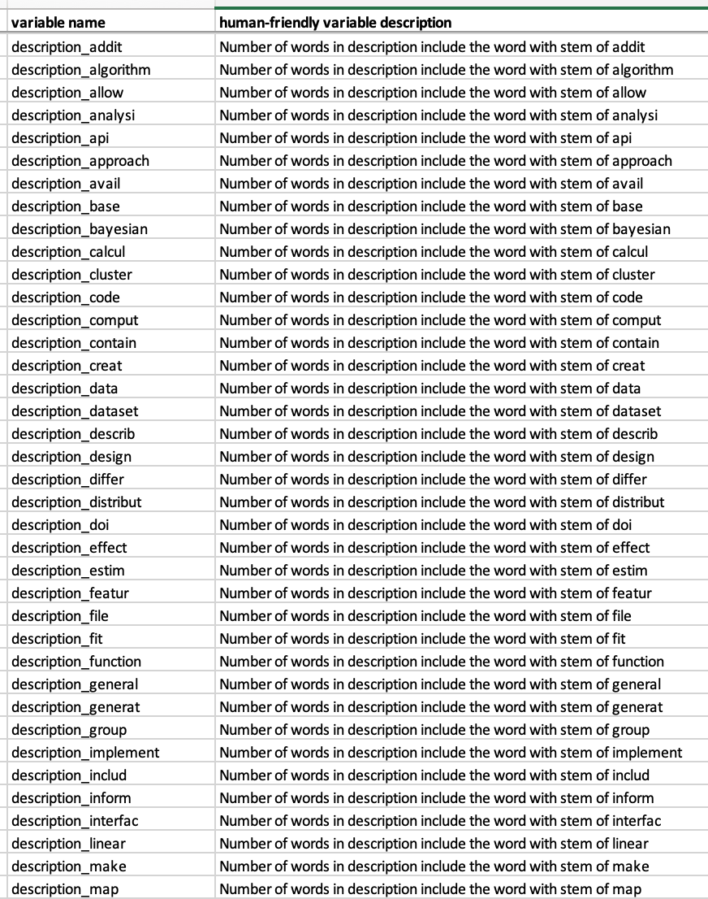
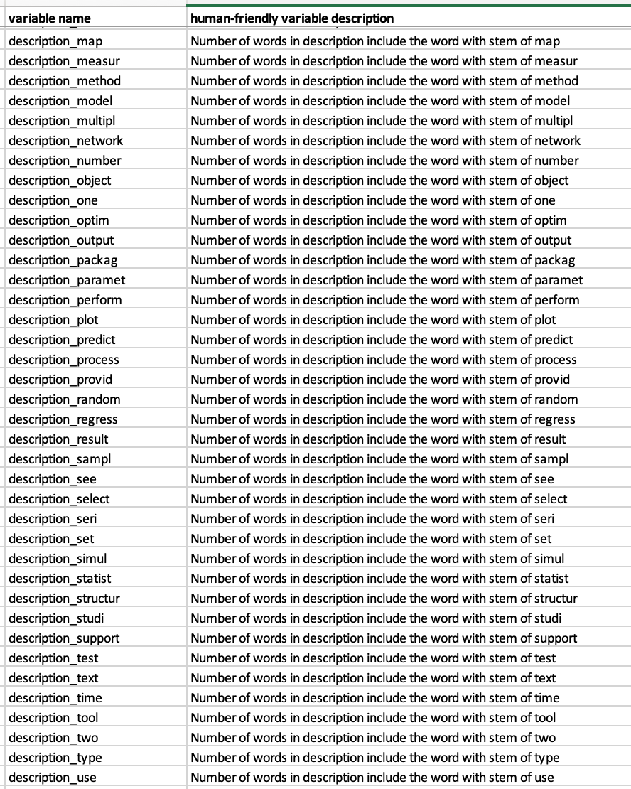
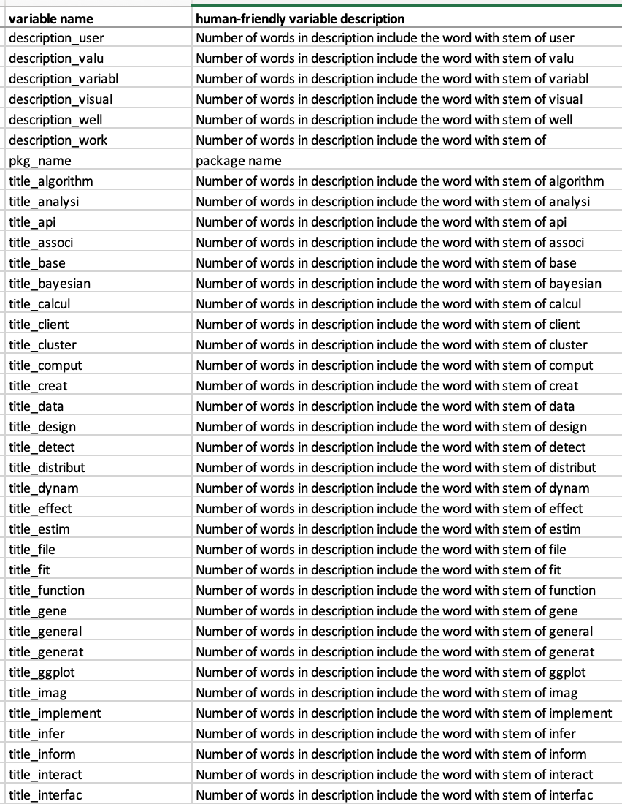
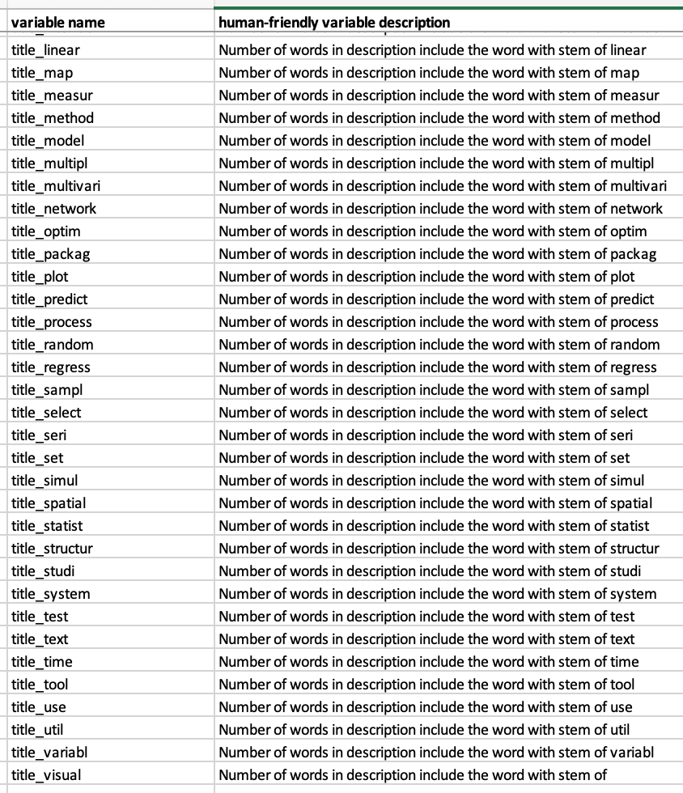
```

## Package documentation and vignette: data collection 

### Processing overview 

- We aimed at deriving package's features based on **package's documentation and vignette**. 

- Our first "old approach" assumed the variables we derive are based on: 

    - For package's documentation: scrapping the package PDF manual (documentation) in a version currently available on CRAN; 
    - For package's vignette: scrapping the package vignette PDF document(s) in a version currently available on CRAN.
    - In this initial approach, PDF documents from CRAN were firstly downloaded and their content was processed with R functions dedicated to reading PDF files. Specifically: a PDF was being downloaded, saved under some temporary name, processed and deleted immediately after for the sake of space saving. The process was coded in **parallel manner**; here, we had to be cautious and save temporary files under different names so as parallel processes are not working/deleting same file etc. 
    - **This approach has been discarded** as we decided to utilize data corresponding to 1st package release to CRAN.   <br/> <br/>
  
- Our "new" (final) approach assumed the variables we derive are based on: 

    - For package's documentation: exploring the files present in the `man` directory found in Package source zip corresponding to the first release of the package; 
    - For package's vignette: exploring the files present in the `vignettes` directory found in Package source zip corresponding to the first release of the package. As a vignette, we considered any `Rmd`/`Rnw`/`md` document found in `vignettes` folder in the package directory. 
    - **The package source zips** corresponding to the first release of the package for each of approx. 2,300 packages considered have been **downloaded to a local machine** of one of us so as not to take over the shared Dropbox area. The downloading and processing code stays reproducible.<br/><br/>
     

- The derived variables meaning should be clear based on human-readable explanation we provide in databook (see `Final variables description` below). 

### Processing code files

`R Markdown` files in which the package documentation-related features are generated are stored in `712-final_project/Rmd_files/2018-11-25-feature_task_part3` directory. These include: 

1. `2018-11-25-feature_task_part3.Rmd` - "old" approach code,
2. `2018-11-29-feature_task_part3_REDO.Rmd` - "new" (final) approach code.

### Final variables description 

```{r var_desc_documentation, echo=FALSE,  out.width = '100%'}
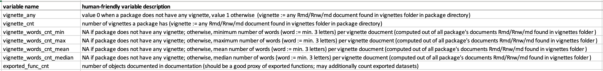
```

## Package other meta data: data collection 

### Processing overview 

- We aimed at deriving package's features based on **package's meta data** files. 

- All these features are derived based on the DESCRIPTION files present in the Package source zip corresponding to the first release of the package. **The package source zips** corresponding to the first release of the package for each of approx. 2,300 packages considered have been **downloaded to a local machine** of one of us so as not to take over the shared Dropbox area. The downloading and processing code stays reproducible.  

    - Features extracted from the DESCRIPTION file in the source file. The Package's Version, Type of License, Use of Roxygen and number of dependencies were extracted directly from the source file in the local machine. 
    - The Package Version was dichotomized to 0/1 in order to show if the Package was released with a 'stable' (start with 1, i.e. 1.00.01) or 'not stable' (starts with 0).
    - Types of License were grouped to 18 levels from 62 originally found.
    - The number of dependencies were extracted using the `desc_get_deps` function from the `desc` package.<br/><br/>

- The identification of authors was challenging given that not all first released versions located the authors and descriptions in the `@Authors` field. 

    - Thus, we took a managerial decision to use the authors of the current versions of the packages with the assumption that authors do not change significantly from first to current version. 
    - We use the `CRANtools` function from the `tools` package to obtain information of the current versions in CRAN.<br/><br/>

- Another challenging feature was the minimum `R` Version required for the package. This feature usually exists in the field `Depends`; however that was not the case for many packages. 

    - We first identify those packages that show compatibility with specific `R` versions, and get the older `R` version. 
    - For the packages that did not state the `R` version, we tracked the package's date of release and compared to the releases of `R` versions. We used the closest `R` version after the Package's released .<br/><br/>
    
- The derived variables meaning should be clear based on human-readable explanation we provide in databook (see `Final variables description` below). 

### Processing code files

`R Markdown` file with the code used to derive the features is stored at `712-final_project/Rmd_files/2018-11-25-feature_task_part2/2018-11-25-feature_task_part2.rmd`. 

### Final variables description 

```{r var_desc_meta, echo=FALSE,  out.width = '100%'}
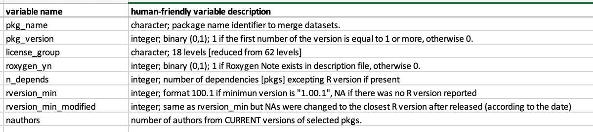
```

## Code and attached data features: data collection 

### Processing overview 

- We aimed at deriving package's features based on **package's code and attached data** files. 

- All these features are derived based on files present in Package source zip corresponding to the first release of the package. **The package source zips** corresponding to the first release of the package for each of approx. 2,300 packages considered have been **downloaded to a local machine** of one of us so as not to take over the shared Dropbox area. The downloading and processing code stays reproducible.  

- The derived variables meaning should be clear based on human-readable explanation we provide in databook (see `Final variables description` below). 

### Processing code files

`R Markdown` file with the code used to derive the features is stored at `712-final_project/Rmd_files/2018-12-01-feature_task_from_code.Rmd`. 

### Final variables description 

```{r var_desc_code, echo=FALSE,  out.width = '100%'}
# 
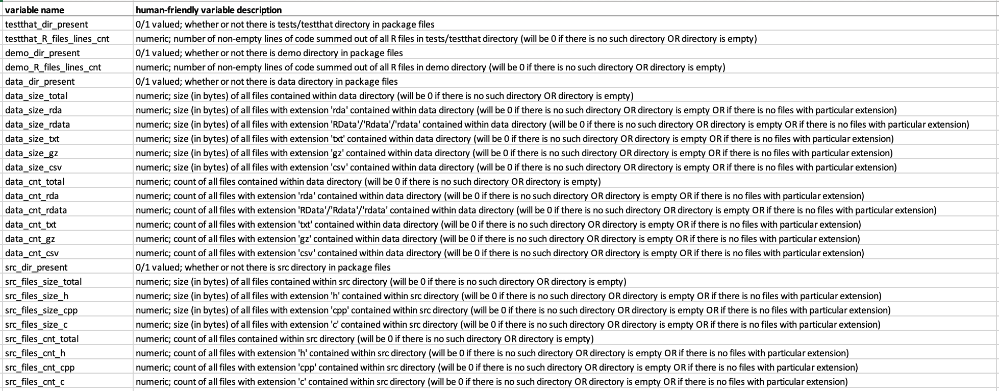
```


## Outcome: data collection 

- For each package, we derived 2 types of outcomes: 

    1. `download_cnt_90d`- total number of downloads over 0-90 days after the package's 1st release to CRAN,
    2. `download_cnt_365d`- total number of downloads over 0-365 days after the package's 1st release to CRAN. <br/><br/>

- The above statistics were derived with the use of `cranlogs::cran_downloads` function ("Daily package downloads from the RStudio CRAN mirror"). 

### Processing code files

`R Markdown` file with code used to derive the outcome is stored at `712-final_project/Rmd_files/2018-11-27-feature_task_outcome/2018-11-27-feature_task_outcome.Rmd`.


## Putting it all together 

The feature deriving and engineering work was divided into modules. The **final** explanatory variable and outcome variable **data sets** are stored at the following locations: 

- `712-final_project/data/final_dfs/data_x.csv` - final explanatory variable data set,
- `712-final_project/data/final_dfs/data_y.csv` - final outcome data set.

### Basic statistics summary

- We have `2325` total number of `R` packages for which we have collected the data. 

- We have two outcomes that we will model separately: 

    1. total number of downloads over 0-90 days after the package's 1st release to CRAN,
    2. total number of downloads over 0-365 days after the package's 1st release to CRAN. <br/><br/>
    
- We have `185` total derived variables (`186` columns minus column for package ID) in `data_x.csv` final explanatory variable data set.


# Exploratory Data Analysis

## Outcome (number of downloads of the packages) explored 

We started with investigating boxplots of the two outcome variables:     

  1. `download_cnt_90d` - total number of downloads over 0-90 days after the package's 1st release to CRAN,
  2. `download_cnt_365d` - total number of downloads over 0-365 days after the package's 1st release to CRAN. 
    
These are presented on two plots below. The Second plot differs from the first one in that it has Y-axis upper limit cut. 

```{r EDA_outcome_A, echo=FALSE, out.width = '49%'}
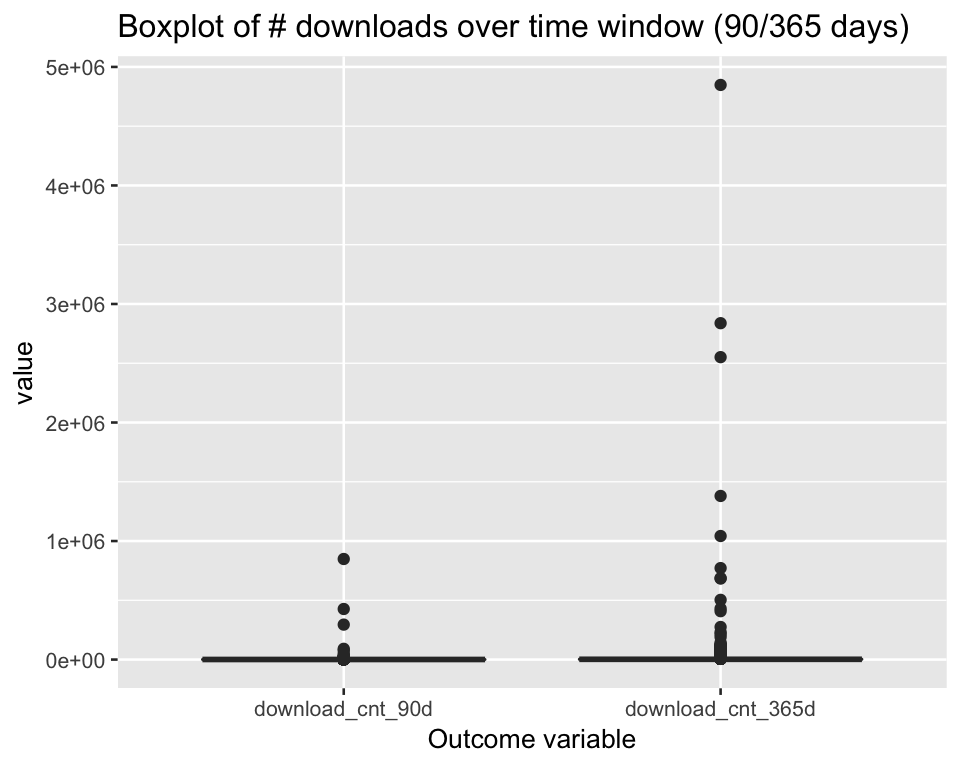
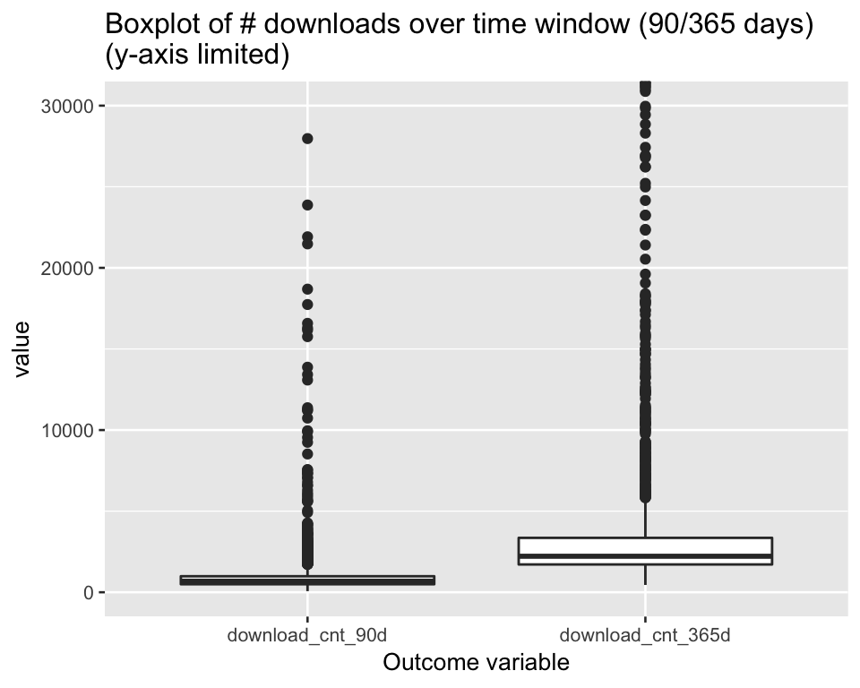
```

We then investigated the outcomes after logarythmic transformation, as showed below. 

```{r EDA_outcome_B, echo=FALSE, out.width = '49%'}
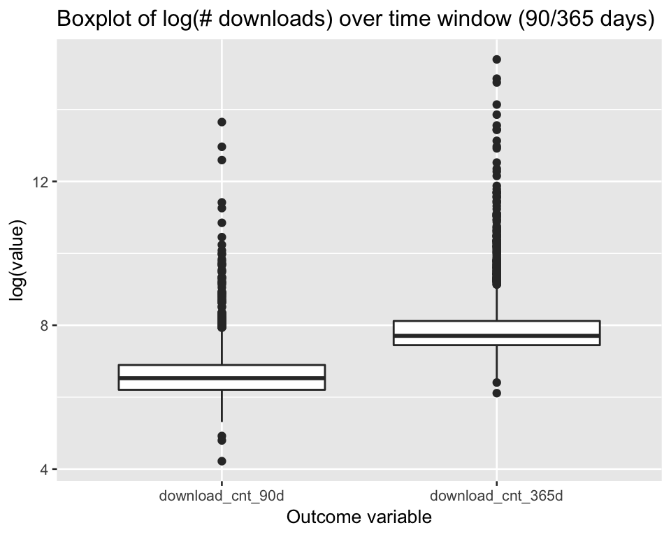
```

Given above, **we decided to focus and limit our analysis to variables after log transformation** because they exibit more reasonable distribution in the sample we have.

### Reproducible code information

- The reproducible code used to generate the above plots is a part of the script located at  `712-final_project/Rmd_files/2018-11-27-feature_task_outcome/2018-11-27-feature_task_outcome.Rmd`. 


In this section, we answer the questions: 

- What visualizations did we use to look at data in different ways? 
- What are the different statistical methods we considered? 
- How did we reach these conclusions? 

We also: 

- Justify the decisions we made, and show major changes made to out ideas. 
- Motivate the statistical analyses that we decided to use for data analysis. 

## Package title and description explored 

Glance at the potential features via terms cloud obtained from text from packages title (*LEFT HAND SIDE*) and from packages description (*RIGHT HAND SIDE*):

```{r word_cloud, echo=FALSE,  out.width = '49%'}
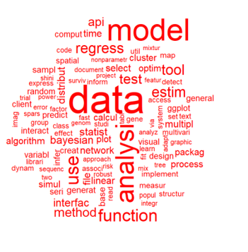 ## MK: I think this corresponds to TITLE
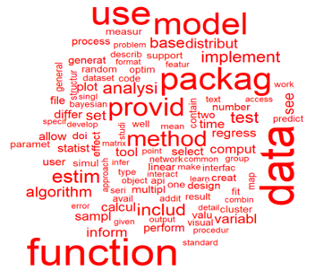       ## MK: I think this corresponds to DESCRIPTION
```

Barplot of top frequent terms obtained from text from packages title (*LEFT HAND SIDE*) and from packages description (*RIGHT HAND SIDE*):

```{r word_count_barplot, echo=FALSE,  out.width = '49%'}
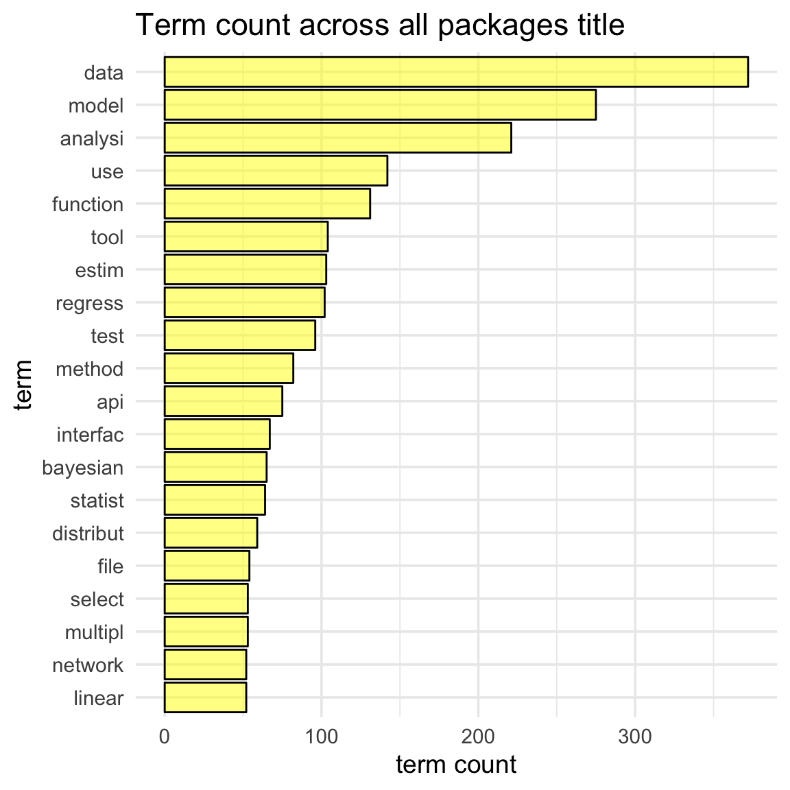
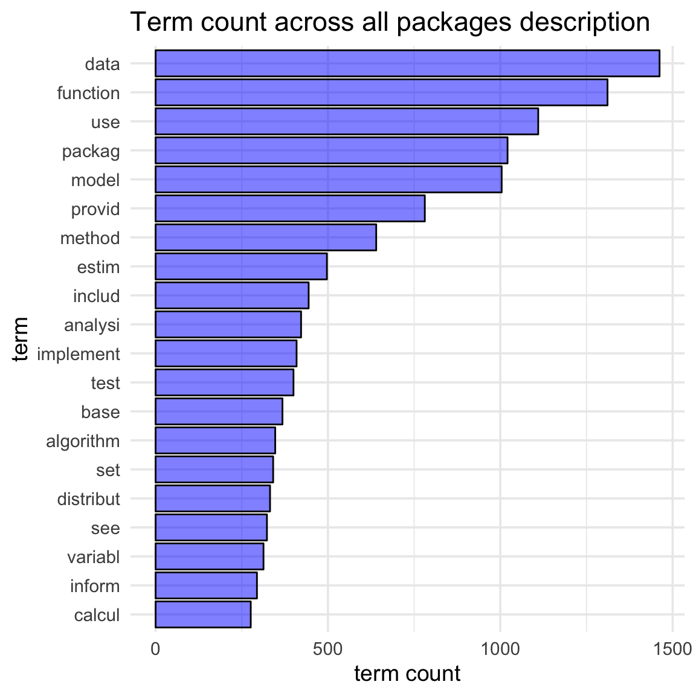
```


## Package documentation and vignette explored 

* 33\% out of 2,325 packages considered have at least one vignette. 

* The below boxplot shows boxplot of `log(# of downloads over 1y)` among packages, stratified by whether or not a package has a vignette. We can see that the median of `log(# of downloads over 1y)` **outcome is slightly larger in group with at least one vignette**.

```{r EDA_vignette_cnt_vs_downloads, echo=FALSE, out.width = '55%'}
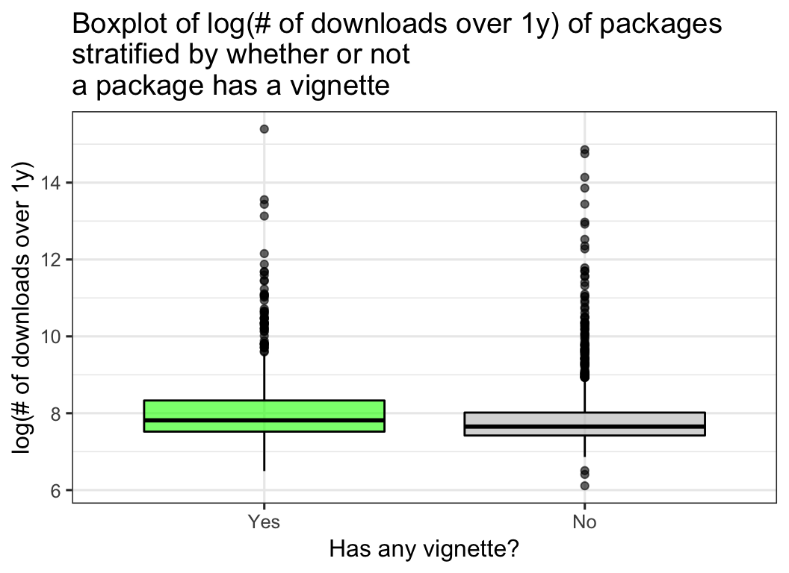
```

* The plot below shows the vignette count in a group of packages that have at least one vignette.  **In the group of packages that have at least one vignette, most of the packages (76\%) have 1 vignette**. 

```{r EDA_vignette_cnt, echo=FALSE, out.width = '80%'}
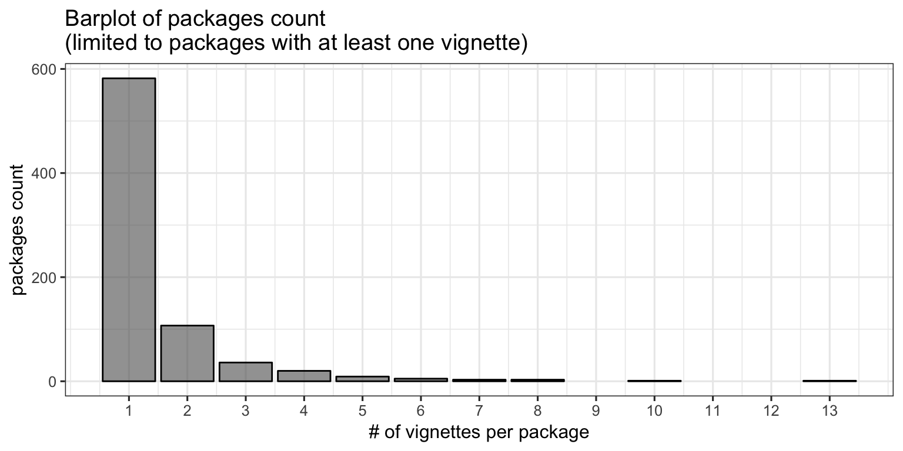
```

* The plot below shows boxplot of number of words (word := 3 or more letters)  in vignette (median value across all package's vignettes if package has >1 vignette). We can see that **most of the vignettes are between 300 and 1,500 words long**, but there are some very long ones as well (with max. value equal to 10,470).

```{r EDA_vignette_words_cnt_median, echo=FALSE, out.width = '60%'}
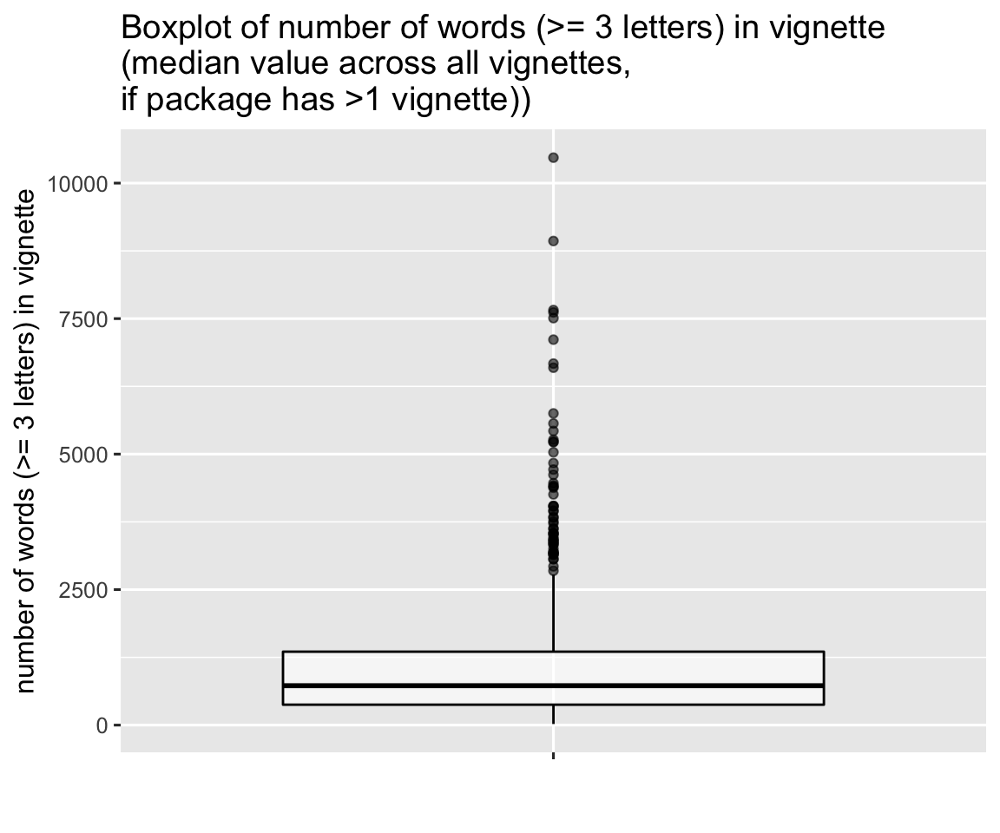
```

### Reproducible code information

- The reproducible code used to generate the above statistics and plots is a part of the script located at  `712-final_project/Rmd_files/2018-12-12-EDA_features/2018-12-12-EDA_features.Rmd`. 


## Package other meta data explored

* 37\% out of 2,325 packages were released as an 'stable' version (first digit of number version was 1 or more).

* 76\% out of 2,325 packages were built using `Roxygen`. The below graph shows a boxplot of `log(# of downloads over 1y)` among packages, stratified by whether or not `Roxygen` was used. We can see that the median of `log(# of downloads over 1y)` **outcome is slightly larger in group that used `Roxygen`**.

```{r EDA_Roxygen, echo=FALSE, out.width = '80%', fig.align='center'}
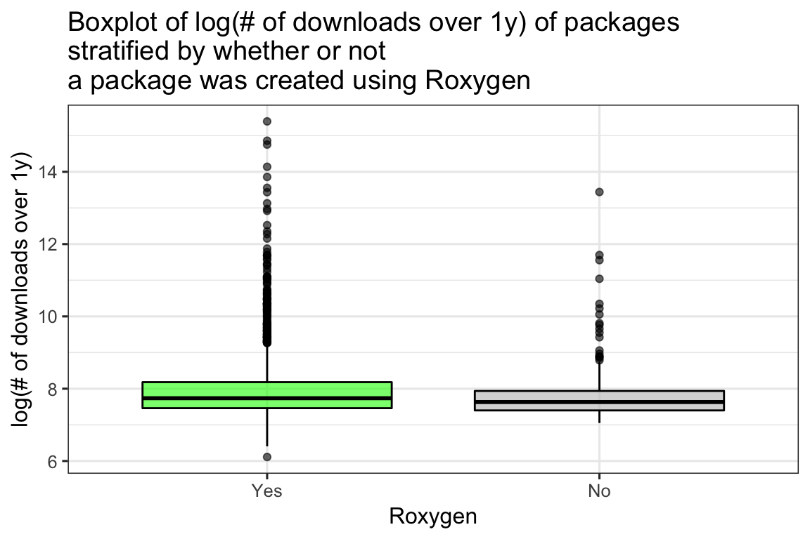
```

* With regard to the type of License,** we found that most of the packages (73\%) had a GPL-like License**

```{r EDA_license_group, echo=FALSE, out.width = '80%', fig.align='center'}
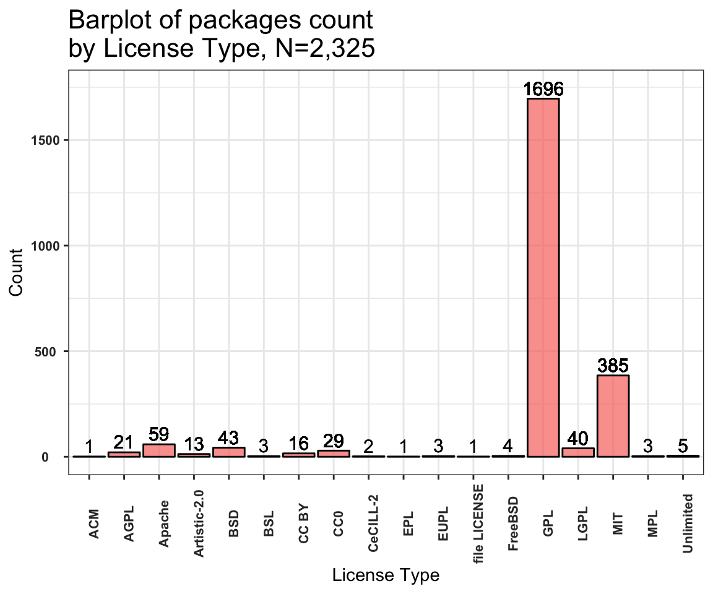
```

* Similarly, **we found that 52\% of the packages had only one author; however, there were packages with more than 20 authors**.

```{r EDA_nauthors, echo=FALSE, out.width = '80%', fig.align='center'}
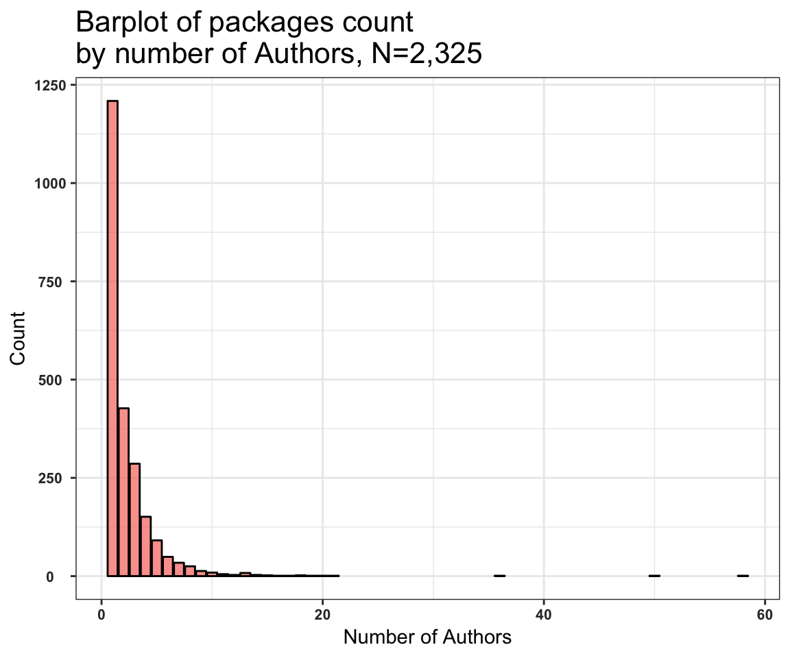
```

### Reproducible code information

- The reproducible code used to generate the above statistics and plots is a part of the scripts located at  `712-final_project/Rmd_files/2018-11-25-feature_task_part2/2018-11-25-feature_task_part2.rmd` and `712-final_project/Rmd_files/2018-12-12-EDA_features/2018-12-12-EDA_features_2_DA.Rmd`. 

## Code features explored 

* The below barplot shows percentage of packages (out of 2,325 packages considered) for which a particular directory was found in their 1st release source files zip: 

    - `demo` directory, 
    - `src` directory, 
    - `testthat` directory. <br/> <br/> 
    
```{r EDA_directory_present, echo=FALSE, out.width = '60%'}
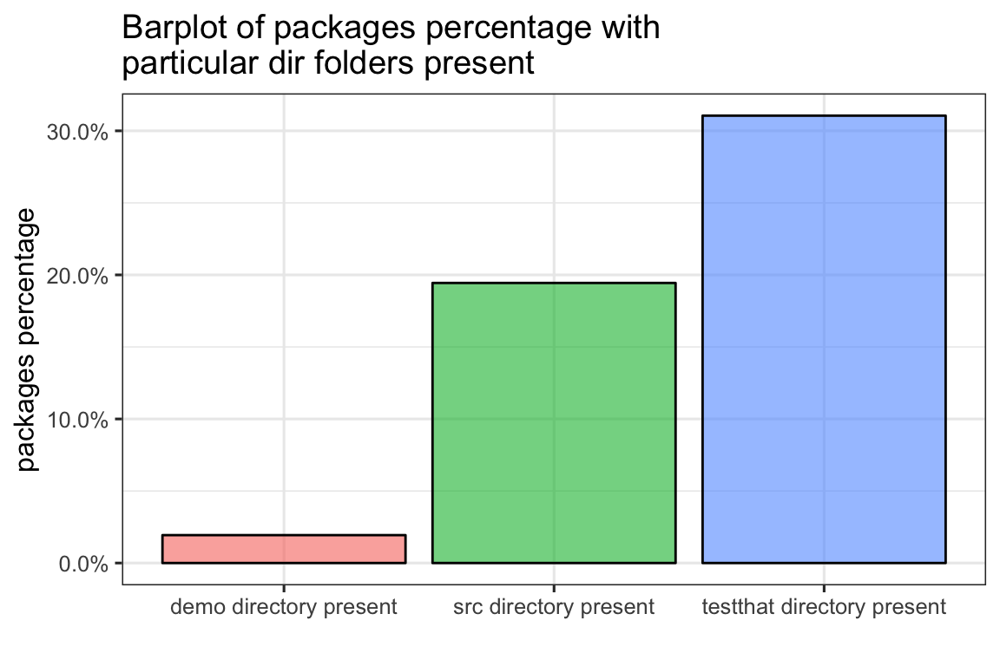
```

* Interestingly, **more than 30% packages had unit tests implemented via `testthat` package**. 

* The below plots show boxplot of `log(# of downloads over 1y)` among packages, stratified by whether or not a package has a particular directory. We can see that the median of `log(# of downloads over 1y)` **outcome is noticeably higher in group with `testthat` directory present**.

```{r EDA_dirs_vs_downloads, echo=FALSE, out.width = '49%'}
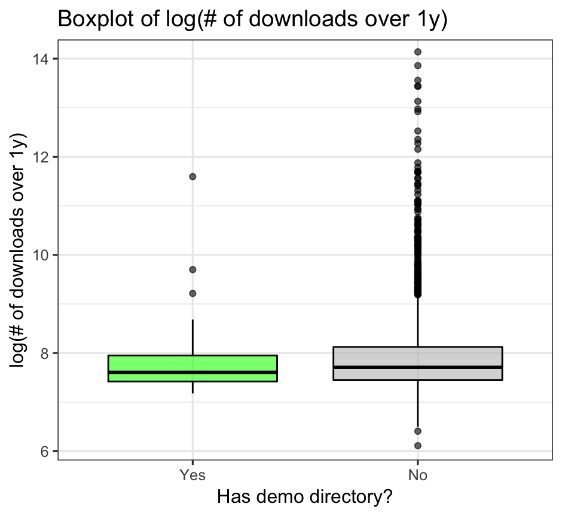
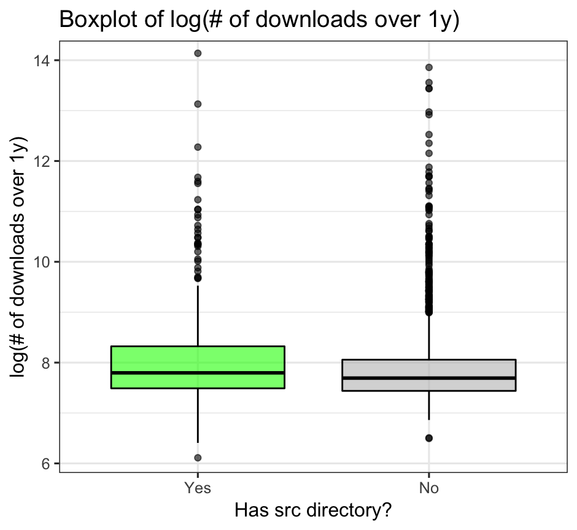
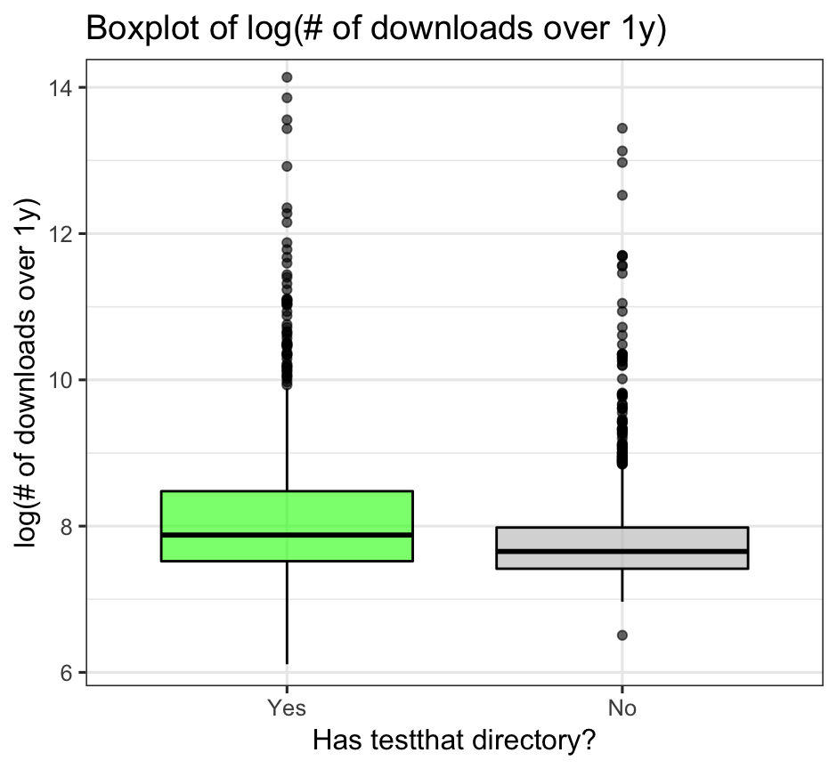
```

### Reproducible code information

- The reproducible code used to generate the above statistics and plots is a part of the script located at  `712-final_project/Rmd_files/2018-12-12-EDA_features/2018-12-12-EDA_features.Rmd`. 


## Changes to primary ideas 

-**Use available and latest CRAN packages to get metadata and other features.** We confirmed that most packages have had several new versions from first release. This make difficult to establish a correlation between current status of the package and number of downloads at 3 and 12 months. Therefore, we decided to scrap the CRAN archives of each package and collect the first released version. 

-**Use author data from CRAN, repositories such as PubMed, job information, etc.** Given that we use the first released packages in CRAN, most of them did not correctly identified the authors using the @Author label. This made very difficult to find the authors in the package. Furthermore, we found that many authors had homonymous in Pubmed and other repositories, making very difficult their identification and the consequent extraction of features such as number of papers or current job status. Thus, we decided not to include this extra features about package authors. However, we assume that package authors did not change significantly throughout the time, and included information about authors from the current version of the package.

-**Random Forest with Repeated Cross Validation.** Random Forest estimation using repeated cross validation (n=10) took more than 24 hours when it was stopped. Therefore, we decided for effiency to use Cross Validation only for Random Forest using 10 partitions in each round.

## Conclusion 

Our team decided that in order to get valid estimates, we should, first and foremost, use the first released package in the CRAN repository. This will assure that the number of downloads (outcome of interest) happen due to initial features of the package; thus, temporality might hold. Also, we selected packages released in a 1 year timeframe to avoid any cohort effects. Similarly, we selected two 'moments' for the outcome: number of downloads after 90 days (3 months) and 360 days (1 year). We use all data available from text mining (title and description), package metadata and files included in the package to predict the number of downloads. We decided to use three different approaches: Linear models, Random Forests and Support Vector Machine to increase the prediction power of the model, minimizing the MSE and maxiziming the R^2^. 


# Data Analysis

In this section, we answer the question: 

- What statistical or computational method did we apply and why? 
- What others did we consider?

## Random Forest approach

- We used three different approaches to select the best random forest model, using for all instances a 10-fold Cross-Validation to minimize the Predicted Root Mean Square Error (RMSE).

    1. Default Model: We set to the recommended values of 500 trees and parameter `mtry` equal to the square root of the number variables in the trainig set.
    2. Auto Model: We set to the recommended value of 500 trees and let `R` to find the best `mtry` parameter.
    3. Tree#: We set to the recommended values of parameter `mtry` and calculated the perfomance of random forests with 50, 100, 500, 1000 and 2000 trees. <br/><br/>
    
- We fit the models to selected two outcomes: 

    1. `download_cnt_90d_LOG`- logarithm of total number of downloads over 0-90 days (approx. 3 months) after the package's 1st release to CRAN,
    2. `download_cnt_365d_LOG`- logarithm of total number of downloads over 0-365 days (approx. 1 year) after the package's 1st release to CRAN. <br/><br/>

- For  `download_cnt_90d_LOG` outcome, the best tunning results were found in the model `tree1000`: 

    - the number of trees used: `1000`,
    - the `mtry` parameter: `11`,
    - corresponding RMSE obtained: `0.6467765`,
    - corresponding $R^2$ obtained: `0.10986923`. <br/> <br/>

- For  `download_cnt_365d_LOG` outcome, the best tunning results were found in the model `auto`: 

    - the number of trees used: `500`,
    - the `mtry` parameter: `101`,
    - corresponding RMSE obtained: `0.7625867`,
    - corresponding $R^2$ obtained: `0.1572620`. <br/> <br/>
    
### Results for predicting `download_cnt_90d_LOG` outcome on test set  

* The below plot on *LEFT* hand side shows observed versus predicted values of logarithm of total number of downloads over 0-90 days on test set.

* The below plot on *RIGHT * hand side shows observed values logarithm of total number of downloads over 0-90 days on test set versus residuals. Clearly, there is association between residual value and  observed value of logarithm of total number of downloads over 0-90 days. 

* The MSE on a test set is 0.457.

* The $R^2$ on a test set is 0.08. 

```{r model_rf_download_cnt_90d_LOG, echo=FALSE, out.width = '49%'}
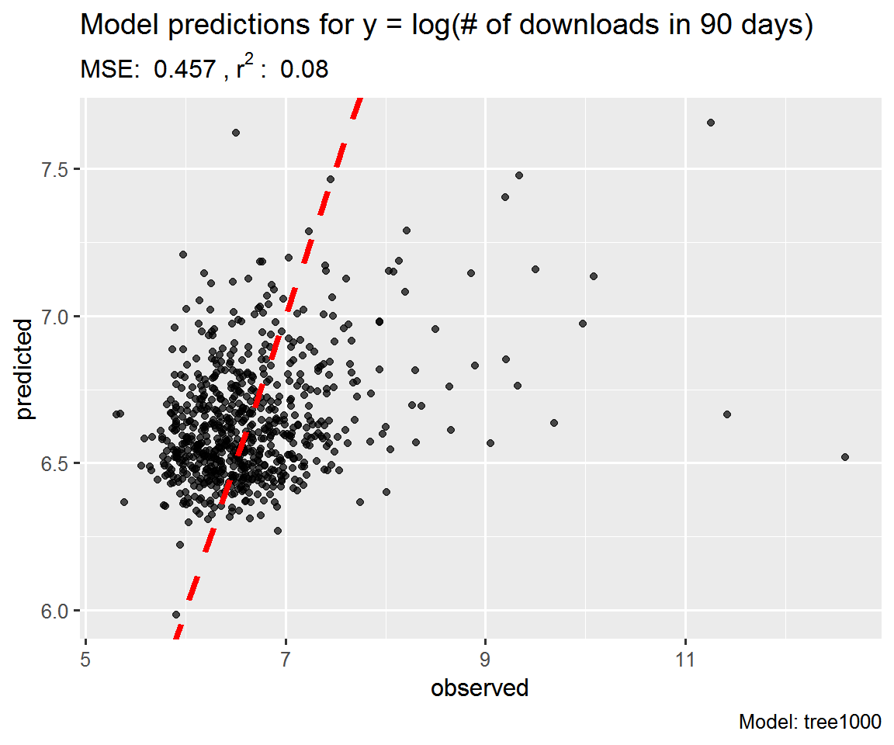
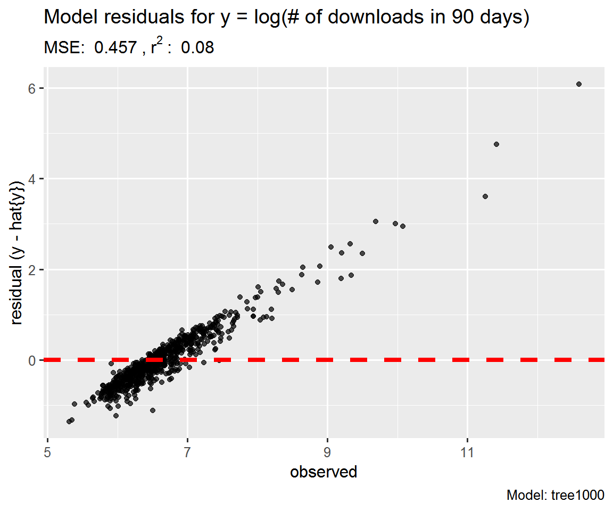 
```


### Results for predicting `download_cnt_365d_LOG` outcome on test set  

* The below plot on *LEFT* hand side shows observed versus predicted values of logarithm of total number of downloads over 0-365 days on test set. 

* The below plot on *RIGHT * hand side shows observed values logarithm of total number of downloads over 0-365 days on test set versus residuals. Clearly, there is association between residual value and  observed value of logarithm of total number of downloads over 0-365 days. 

* The MSE on a test set is 0.657. 

* The $R^2$ on a test set is 0.188. 

```{r model_rf_download_cnt_365d_LOG, echo=FALSE, out.width = '49%'}
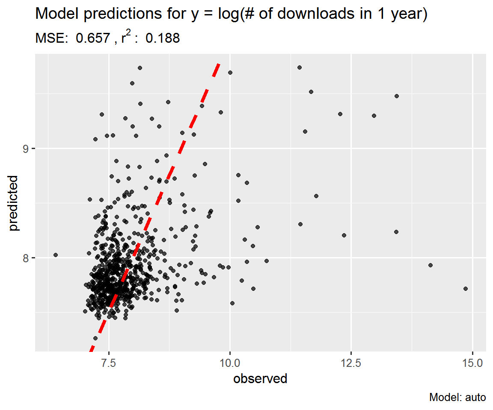
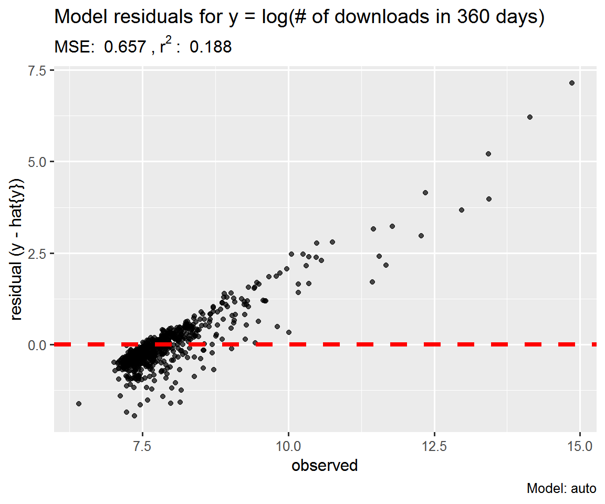 
```


### Results of variable importance

* The below plot shows top coefficient estimates from each of the two outcome models. 

```{r model_rf_coeff_comparison_top10, echo=FALSE, out.width = '100%'}
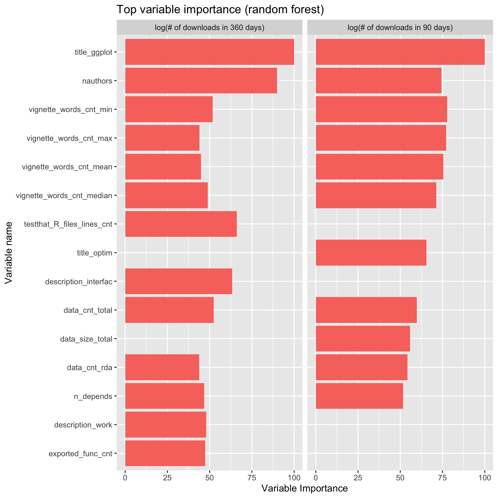
```

### Reproducible code information

- The reproducible code used to generate the above statistics and plots is a part of the script located at  `712-final_project/Rmd_files/2018-12-09-modeling_random_forest/2018-12-09-modeling_rf.Rmd`. 

## Linear Regression (with Lasso coefficient estimation) approach 

- We have fit two separate Linear Regression models to the two outcomes: 

    1. `download_cnt_90d_LOG`- logarithm of total number of downloads over 0-90 days (approx. 3 months) after the package's 1st release to CRAN,
    2. `download_cnt_365d_LOG`- logarithm of total number of downloads over 0-365 days (approx. 1 year) after the package's 1st release to CRAN. <br/><br/>
    
- In each case, the `lambda` regularization parameter was chosen in **10-fold 10-repeated cross-validation performed on the test set** so as to minimize RMSE. 

- For  `download_cnt_90d_LOG` outcome, the tunning results were: 

    - the best lambda obtained: `0.02872464`,
    - corresponding RMSE obtained: `0.6627854`,
    - corresponding $R^2$ obtained: `0.07133483`. <br/> <br/>

- For  `download_cnt_365d_LOG` outcome, the tunning results were: 

    - the best lambda obtained: `0.02472353`,
    - corresponding RMSE obtained: `0.7752640`,
    - corresponding $R^2$ obtained: `0.1339603`. <br/> <br/>
    
### Results for predicting `download_cnt_90d_LOG` outcome on test set  

* The below plot on *LEFT* hand side shows observed versus predicted values of logarithm of total number of downloads over 0-90 days on test set.

* The below plot on *RIGHT * hand side shows observed values logarithm of total number of downloads over 0-90 days on test set versus residuals. Clearly, there is association between residual value and  observed value of logarithm of total number of downloads over 0-90 days. 

* The MSE on a test set is 0.474.

* The $R^2$ on a test set is 0.043. 

```{r model_lm_download_cnt_90d_LOG, echo=FALSE, out.width = '49%'}
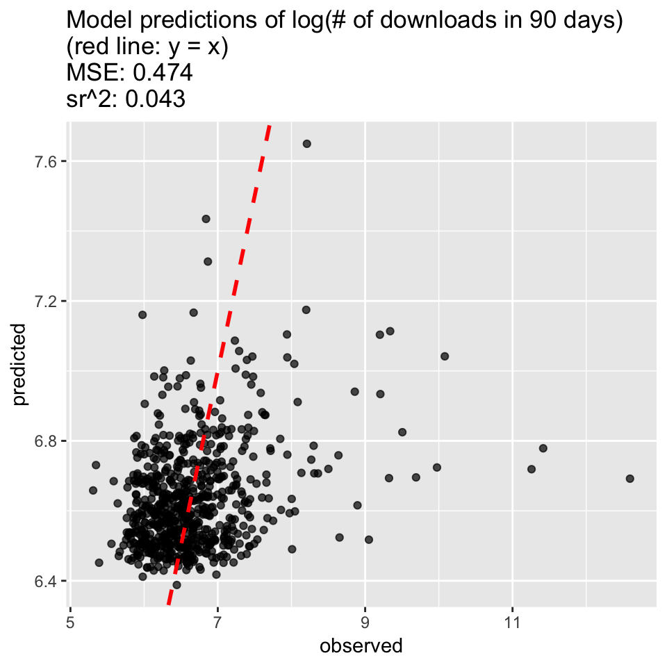
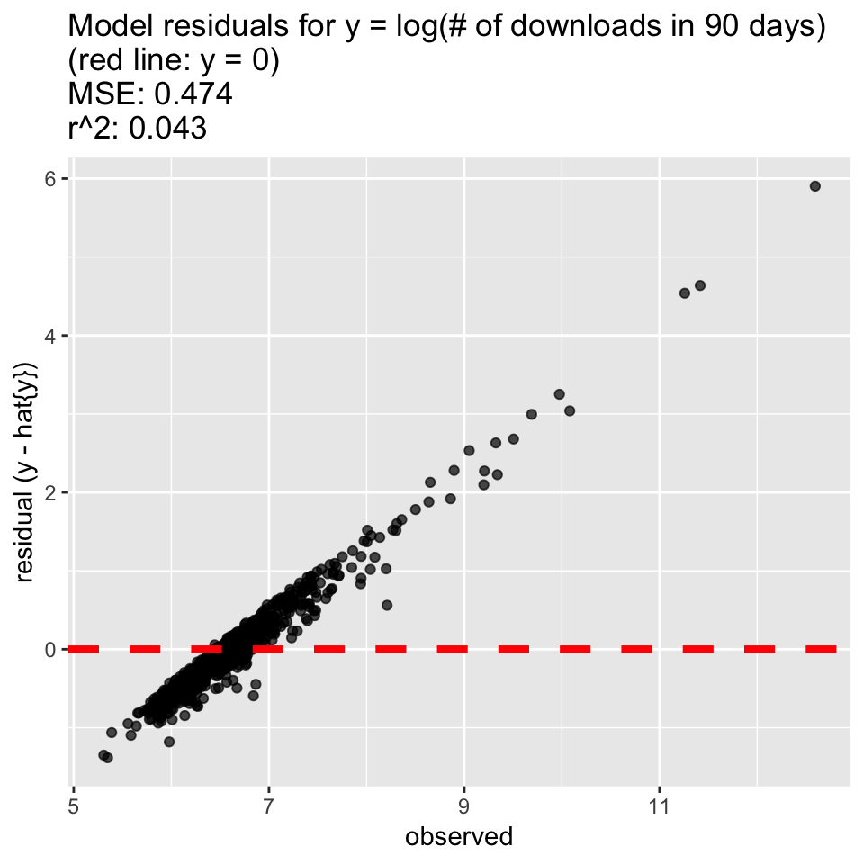
```


### Results for predicting `download_cnt_365d_LOG` outcome on test set  

* The below plot on *LEFT* hand side shows observed versus predicted values of logarithm of total number of downloads over 0-365 days on test set. 

* The below plot on *RIGHT * hand side shows observed values logarithm of total number of downloads over 0-365 days on test set versus residuals. Clearly, there is association between residual value and  observed value of logarithm of total number of downloads over 0-365 days. 

* The MSE on a test set is 0.689. 

* The $R^2$ on a test set is 0.114. 

```{r model_lm_download_cnt_365d_LOG, echo=FALSE, out.width = '49%'}
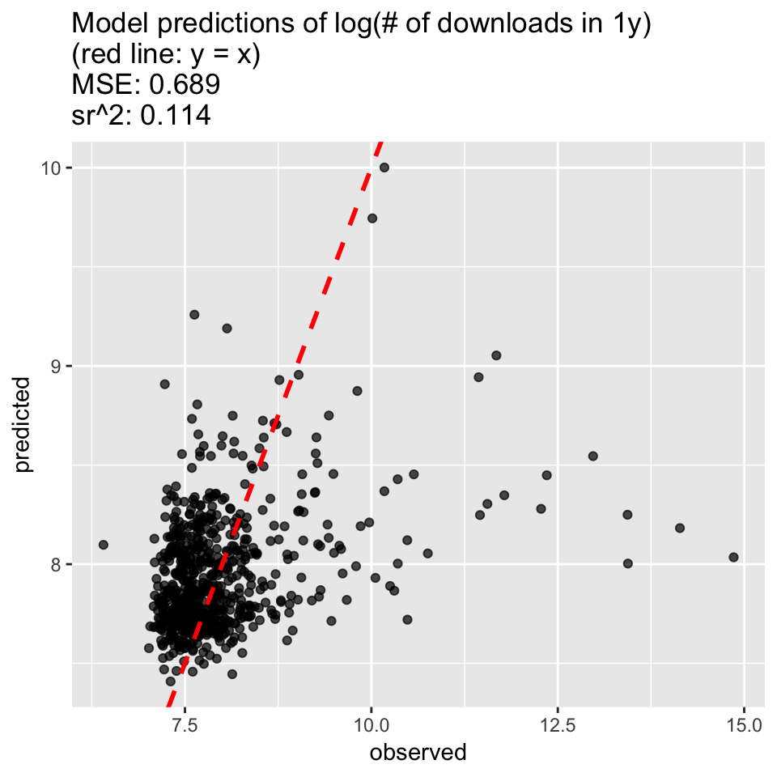
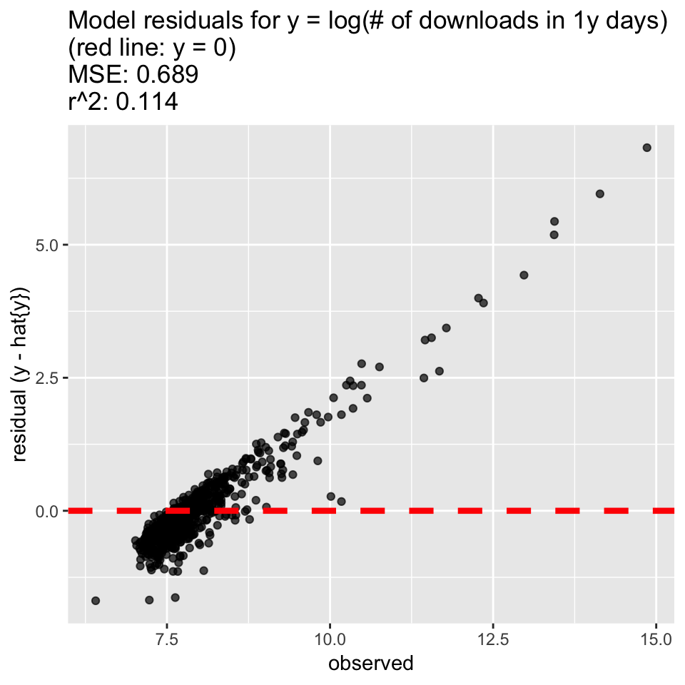
```


### Results of coefficient estimation

* The below plot shows top coefficient estimates from each of the two outcome models. 

```{r model_lm_coeff_comparison_top10, echo=FALSE, out.width = '100%'}
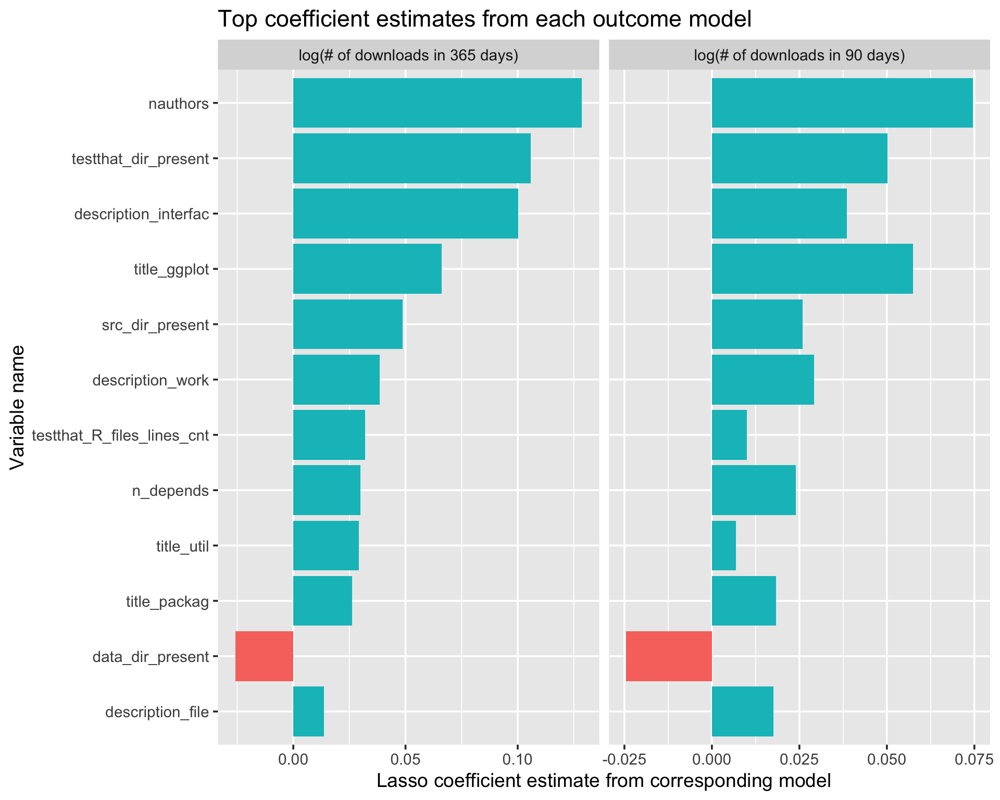
```

### Reproducible code information

- The reproducible code used to generate the above statistics and plots is a part of the script located at  `712-final_project//Rmd_files/2018-12-09-modeling_linear_model/2018-12-09-modeling_linear_model.Rmd`. 

## SVM approach


- We have fit two separate models using support vector machine (radial) to the two outcomes: 

    1. `download_cnt_90d_LOG`- logarithm of total number of downloads over 0-90 days (approx. 3 months) after the package's 1st release to CRAN,
    2. `download_cnt_365d_LOG`- logarithm of total number of downloads over 0-365 days (approx. 1 year) after the package's 1st release to CRAN. <br/><br/>

- Due to the small variance in the variables about licence, we exclude all the information about licence using `select(-starts_with("license_"))` for svm model. 

- We initially tried both support vector machine (linear) and support vector machine (radial) to fit both outcomes. However, it took more than 24 hours to tune the parameters in the support vector machine (linear) for one outcome, so we decided to focus on using support vector machine (radial). In each case, the `lambda` regularization parameter was chosen in **10-fold 10-repeated cross-validation performed on the test set** so as to minimize RMSE. 
    
- In each case, the parameters were chosen in **10-fold 10-repeated cross-validation performed on the test set** so as to minimize RMSE.  


- For  `download_cnt_90d_LOG` outcome, the tunning results were: 

    - the best parameters obtained: `sigma = 0.0033` and `C = 0.53` ,
    - corresponding RMSE obtained: `0.6653641`,
    - corresponding $R^2$ obtained: `0.08002368`. <br/> <br/>

- For  `download_cnt_365d_LOG` outcome, the tunning results were: 

    - the best parameters obtained: `sigma = 0.00414` and `C = 4` ,
    - corresponding RMSE obtained: `0.7864176`,
    - corresponding $R^2$ obtained: `0.1270128`. <br/> <br/>
    
### Results for predicting `download_cnt_90d_LOG` outcome on test set  

* The below plot on *LEFT* hand side shows observed versus predicted values of logarithm of total number of downloads over 0-90 days on test set.

* The below plot on *RIGHT * hand side shows observed values logarithm of total number of downloads over 0-90 days on test set versus residuals. Clearly, there is association between residual value and  observed value of logarithm of total number of downloads over 0-90 days. 

* The MSE on a test set is 0.499.

* The $R^2$ on a test set is 0.074. 

```{r model_svm_download_cnt_90d_LOG, echo=FALSE, out.width = '49%'}
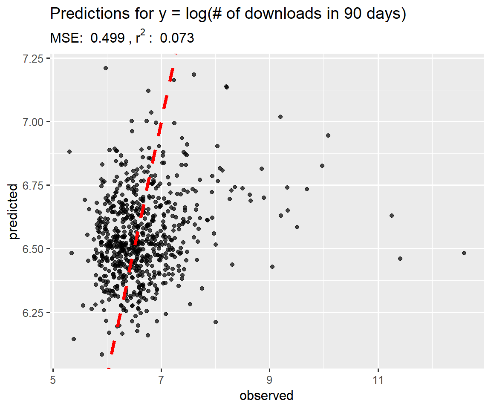
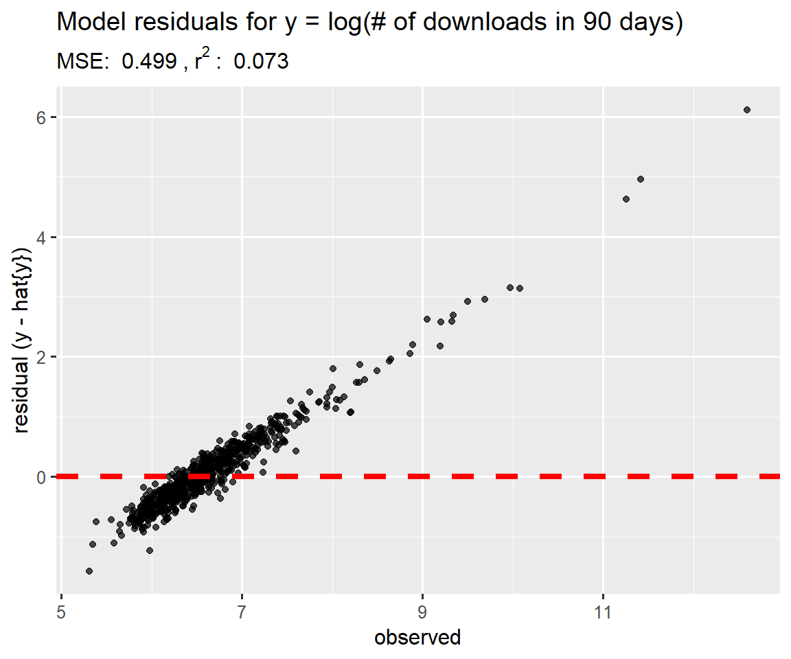
```


### Results for predicting `download_cnt_365d_LOG` outcome on test set  

* The below plot on *LEFT* hand side shows observed versus predicted values of logarithm of total number of downloads over 0-365 days on test set. 

* The below plot on *RIGHT * hand side shows observed values logarithm of total number of downloads over 0-365 days on test set versus residuals. Clearly, there is association between residual value and  observed value of logarithm of total number of downloads over 0-365 days. 

* The MSE on a test set is 0.672. 

* The $R^2$ on a test set is 0.174. 

```{r model_svm_download_cnt_365d_LOG, echo=FALSE, out.width = '49%'}
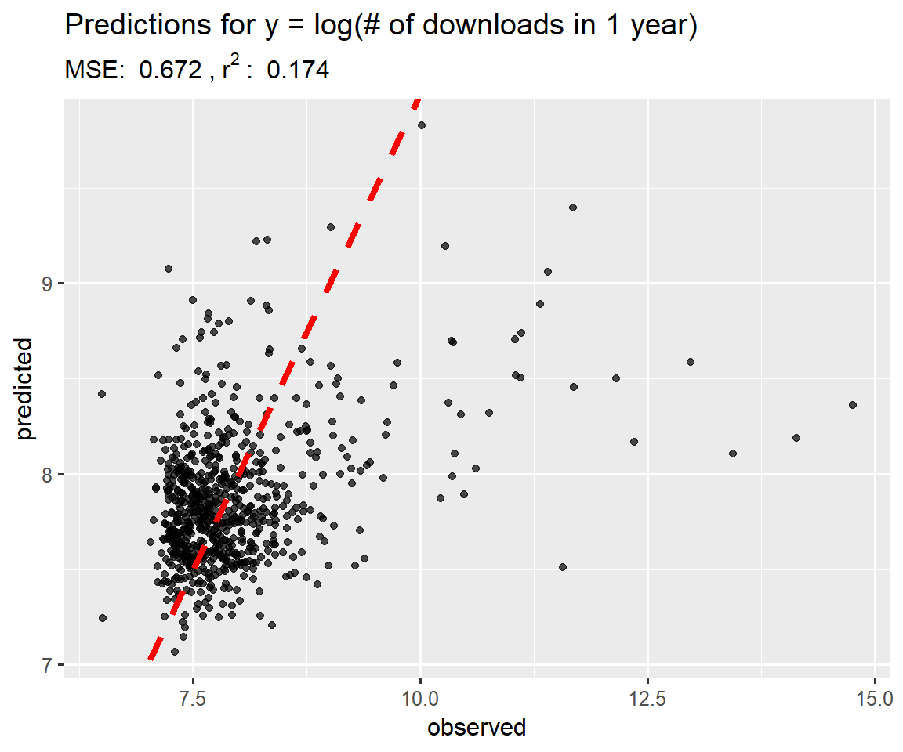
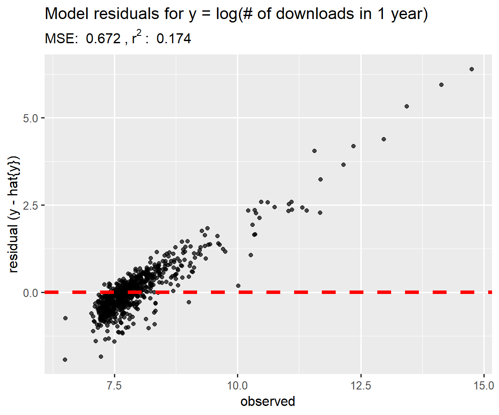
```


### Screenshots of parameter tuing process
* The below plot shows the parameter tuing process from the model using downloads over 90 days as outcome. 

```{r model_svm_parameter_tuning_90d, echo=FALSE, out.width = '100%'}
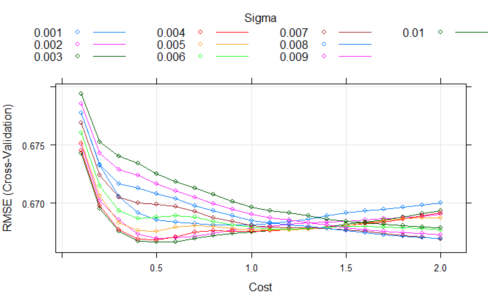
```
* The below plot shows the parameter tuing process from the model using downloads over 365 days as outcome. 

```{r model_svm_parameter_tuning_365d, echo=FALSE, out.width = '100%'}
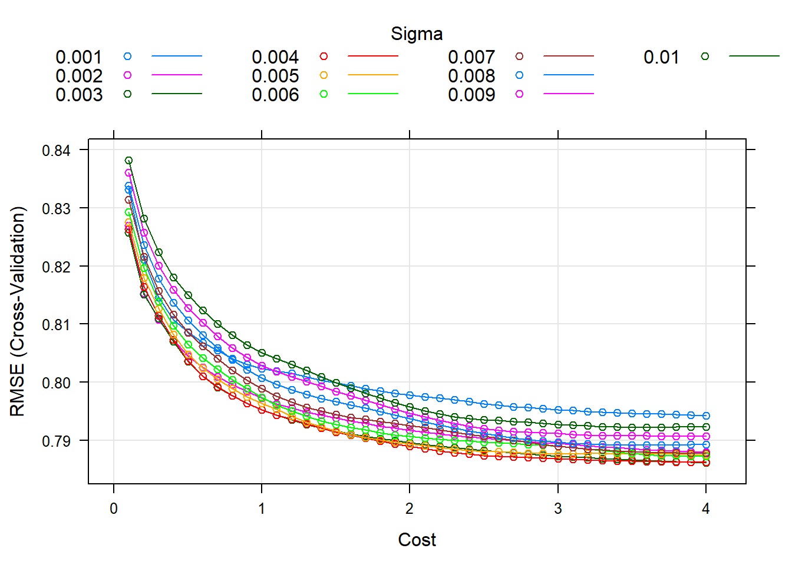
```
   
   
### Reproducible code information

- The reproducible code used to generate the above statistics and plots is a part of the script located at  `712-final_project//Rmd_files/2018-12-09-modeling_svm/2018-12-14-modeling_svm_90dfinal.Rmd` for using downloads over 90 days as outcome and `712-final_project//Rmd_files/2018-12-09-modeling_svm/2018-12-14-modeling_svm_1yfinal.Rmd` for using downloads over 365 days as outcome. 


# Narrative and Summary

In this section, we answer the questions: 

- What did we learn about the data? 
- How did we answer the questions?
- How can we justify your answers? 
- What are the limitations of the analyses?

## Summary of findings and results

Have a table comparing the results from three different models. 
```{r echo=FALSE}
x <- data.frame(Outcome = c(rep("log 90 days downloads",3),rep("log 365 days downloads",3)),
                Methods = rep(c("Random Forest", "Linear Regression (lasso)", 
                                "Support Vector Machine"),2), 
                MSE = c(0.457,0.474,0.499,
                        0.657,0.689,0.672), 
                Rsquared = c(0.08,0.043,0.074,
                               0.188,0.114,0.174))
x %>%
  kable() %>%
  kable_styling()
```

- Random Forest and Support Vector Machine minimize the most MSE in our test dataset for log of number of downloads in one year. However, support vector machine cannot provide us an explicit information about what features are important for the prediction model. 

- The top 5 variables (variable importance rank) capture features related to packages: `title (ggplot)`, `authors (number)`, `unit testing (files)`, `description ("interface")`, `data files`.     
- R package developers should include the top features highlighted in our results to potentially increase the 'success' of their products.         
  

## Limitations of the analysis 

- Feature extractions      

    There are many features for a package, and we are not able to include all of them. For example, the field that a package is designed for is not taken into account in our analysis. And this feature may also play a role in number of downloads. The other example is that some packages have video tutorials or have been distributed to users through conference workshop.    <br/> <br/> 
    
- Outcome definition    

    Indeed, since there are many potential repositories that a package can be distributed, we are not able to check the downloads on several repositories by ourselves. This may lead to the biased measurement of number of downloads, in both 90 days and 1 year.   <br/> <br/> 
    
- Modeling approach   

    Though we tried several models and took log of the outcome due to non-normality, we can see the positive association between the residuals and the observed values in all three models we applied. This may be due to model misspecification or other unmeasured important predictors.   <br/> <br/> 

- Generalizability  

    There are other platforms for the R users to distribute their R packages, such as Bioconductor. Since there are different rules/restrictions about R package deployment, the quality of R and the target users may vary from one platform to the other. We used the R packages stored in CRAN in this project, but making inference on the other platform using this model may be cautious.     <br/> <br/> 

## Lessons learned 

From this project, we understand it is very important to have a well-defined question. 
In the beginning, we tried to build a prediction tool based on the model we tried to build. 
However, it took us some time to get concensus on several issues:   
    
(1) what packages should we included in 
our analysis? (ex: source of packages? within which time period?),     
(2) how do we define 
success of a pacakge? (ex: number of downloads across different time? or becoming a 
required library for other package?),     
(3) after getting concensus on using number of downloads 
as outcome, how are we going to utilize them? (ex: number of downloads within 90 days? or 
doing time series analysis?),     
(4) what features that we should include?,      
(5) what models should 
we implement to build the model? (should we try deep learning that we learned from the class?),     
and 
(6) Prediction model versus prediction tool, what do we want to build?        
    
It turns out that we learned how to use existing tools to facilitate our project, such as parallel 
computing, text mining, and extracting number of downloads. During the process, we found and felt that time is an important 
constraint for the project, and the time we spent on tuning parameters was much longer than 
expected. At the same time, we realized that it was pretty cool to have a shiny app, but in reality, 
the R writers might benefit more if they could know the features of highly downloaded packages in advance instead of putting their package to the shiny app and knowing the prediction model after they almost finish their packages. Not but the least, this is a very joyful journey for all of us to learn more about R, experience the reality of data science (topic with time constraint), and collaborate with each other.    
    

